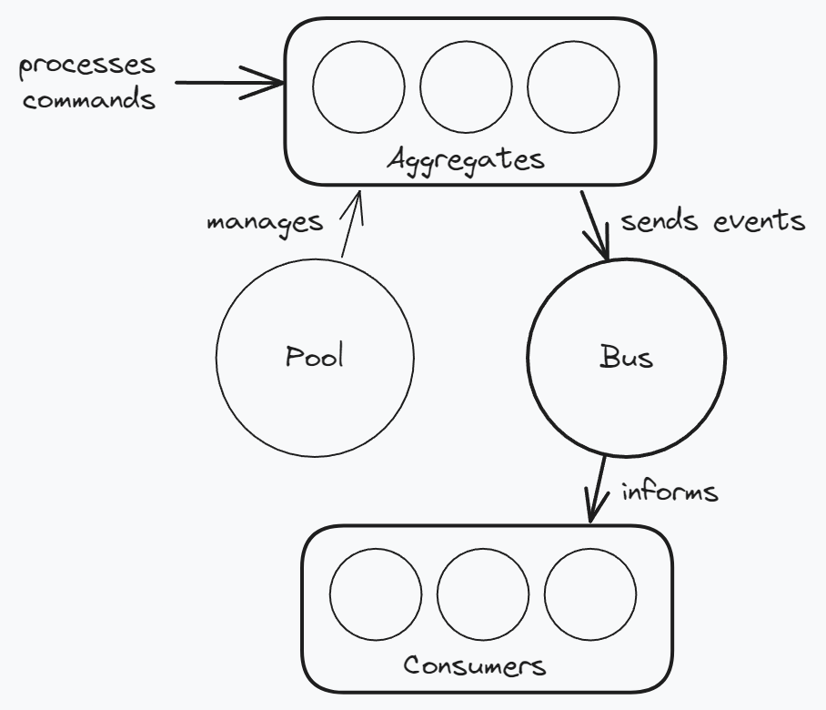

# How signal works

Signal is a light event sourcing library that attempts to keep its interface simple, complexity low, and avoid any "magical" behavior.

A signal service is composed of 3 core elements:

-   An aggregate pool
-   Aggregates
-   A message bus

---

## Architecture

**The Aggregate Pool** actor controls the aggregates in memory, and uses the storage handler to build them up from storage.

**The Aggregates** are actors that use the user defined handlers to process commands, and output events (which also modify their state).

**The Bus** actor forwards all events produced by all aggregates to subscribers, like a pub/sub.

The subscribers include the storage handler which persists events in a database. The subscribers can vary and do all kinds of things, more docs on that are coming.

---

## Consistency

An aggregate which processes a command is always represented by an actor in-memory, and the events produced out of a command are applied to actors state as a part of command execution. This makes **aggregates strongly consistent**. However, the same events are stored to a storage medium in an async manner, making the **storage eventually consistent**.

What this means in practice is that when you process a command, and it returns Ok, your aggregates state is guaranteed to be the latest state. But the database might not be up to date right away.

---

## Delivery guarantees

The subscribers are informed of each event produced by the system as a result of processing a new command, they are not informed of events used by the Pool to hydrate an aggregate from the storage medium. As a rule of thumb this means that the Bus will inform the subscribers **exactly-once** for each event, however this is subject to standard Erlang BEAM VM message passing limitations.
